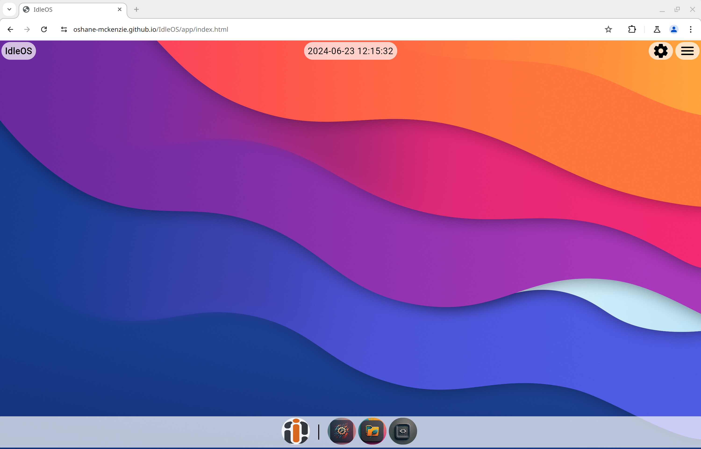
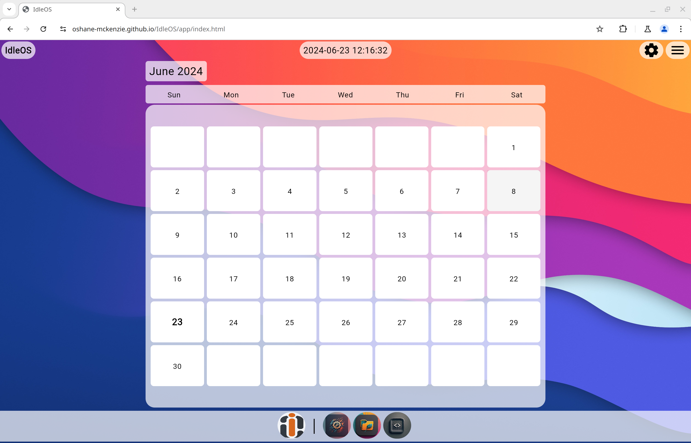
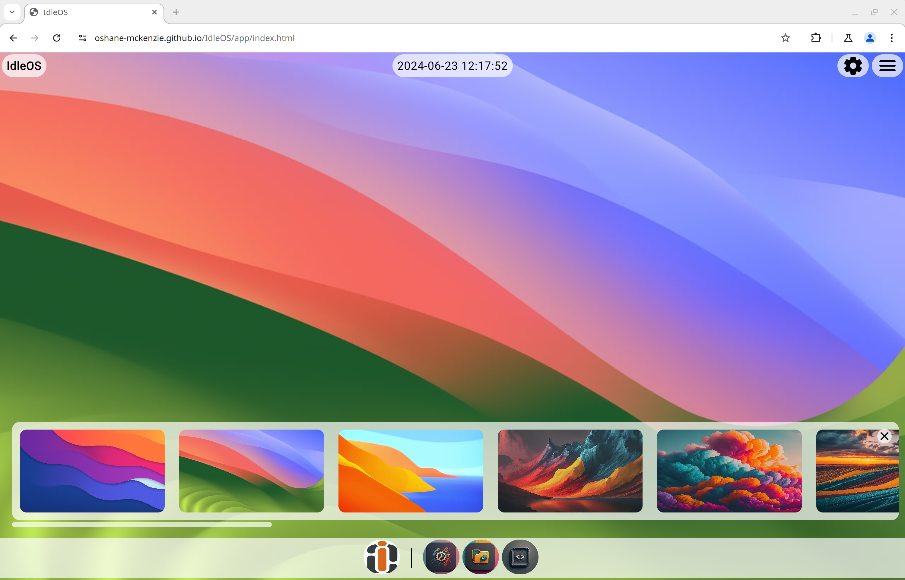
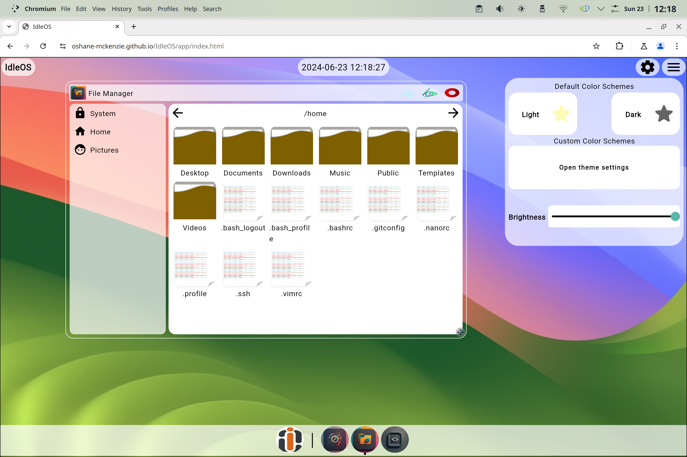

---

# IdleOS
IdleOS is a simulated desktop environment built using Kotlin/WASM and Jetpack Compose

## Overview

Welcome to **IdleOS**! IdleOS is a simulated desktop environment built using Kotlin/WASM and Jetpack Compose. For more information on Kotlin/WASM, check out the [Kotlin/WASM](https://kotlinlang.org/docs/wasm-overview.html).

IdleOS includes a variety of core features you would expect from a desktop environment, such as a panel, dock, terminal, file manager, settings app, control center, info center, and more. Our aim is to create a fun and customizable desktop experience that is accessible and enjoyable for all users.

We are actively seeking contributors to help us enhance IdleOS, especially in developing new features like a browser and a text editor.

## Features

- **Panel**: A versatile panel to manage your tasks and applications.
- **Dock**: Quick access to your favorite and most-used applications.
- **Terminal**: A fully functional terminal for command-line operations.
- **File Manager**: Manage your files and directories with ease.
- **Settings App**: Customize and configure your desktop environment.
- **Control Center**: Access system controls and settings quickly.
- **Info Center**: Get detailed information about your system.

## Screenshots

Take a look at some screenshots of IdleOS in action:

## Try It Out
You can run IdleOS : [IdleOS](https://oshane-mckenzie.github.io/IdleOS/app/index.html)

### Supported Browsers
IdleOS supports all Chromium-based browsers. Please note that it is not supported on Safari, Falkon, and Firefox.

## Contributing

We welcome contributions from the community! If you're interested in helping us build new features, fix bugs, or improve the documentation, please consider contributing.

### Help Wanted

- **Browser**: Develop a browser to enhance the desktop experience.
- **Text Editor**: Create a text editor.

### How to Contribute

1. Fork the repository.
2. Create a new branch for your feature or bugfix.
3. Make your changes and commit them.
4. Push your changes to your fork.
5. Create a pull request detailing your changes.

## License

This project is licensed under the MIT License. See the [LICENSE](LICENSE) file for more details.

---

Thank you for checking out IdleOS! We hope you enjoy using it and look forward to your contributions.

---
